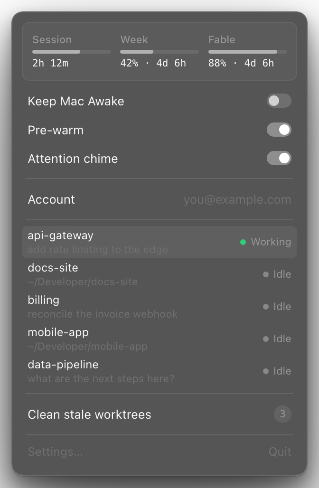

# cctray

A macOS menu bar app for Claude Code and Codex CLI. Shows usage limits, lists running
sessions, and jumps you back to the terminal tab that needs attention.

Requires macOS 14 or later.



## Features

- **Usage** — session, weekly and per-model limits with reset countdowns.
- **Sessions** — running `claude` and `codex` terminal processes, their project and conversation
  title, and whether it is working or idle. Click one to focus its tab.
- **Attention chime** — a sound and a notification when a session finishes,
  suppressed when you are already looking at that tab.
- **New Session** — configurable hotkeys start each enabled agent in your chosen
  folder. Defaults: ⌘⌥C for Claude and ⌘⌥O for Codex.
- **Keep Mac Awake** — blocks idle and lid-close sleep while sessions run.
- **Pre-warm** — sends one cheap prompt when your limit window resets.
- **Clean worktrees** — finds git worktrees with no commits for 7+ days (the
  limit is a setting) and removes them along with their Claude transcripts and
  scratchpads, on request or automatically.
- **Accounts** — save and switch between Claude logins, or add separate Codex logins.

## Codex

Install Codex CLI and run `codex login` with your ChatGPT account. cctray reads
the current account's usage through the installed CLI's
[app-server API](https://developers.openai.com/codex/app-server). API-key logins
do not expose ChatGPT subscription limits. Usage windows and additional limits
use the durations and names returned by Codex. The usage card shows Session,
Week, and Spark side by side. Spark shows its most-used quota window; hover for
both windows. The Session column is hidden when Codex does not report a session
limit. Other missing limits display “—”.

Use **Settings → Agents** to enable or disable Claude and Codex independently,
and record a hotkey for each. Click a shortcut and press a letter or number with
Command, Option, or Control; Escape cancels and Clear removes the binding.
Duplicate agent shortcuts are rejected. Disabled agents disappear from the menu
and stop usage polling, pre-warm, attention notifications, and hotkey launching.
Both enabled agents' terminal sessions appear together. Codex working/idle follows
transcript turn-start, completion, and interruption events, with CPU as a fallback
when no activity signal is available. Claude uses the CPU heuristic. The open menu
refreshes sessions every two seconds. Titles use an open transcript when available, then
the most recently updated transcript for that working directory; multiple
sessions in the same folder can have ambiguous titles.

**Codex account → Add account…** creates a separate Codex home and opens `codex login`.
The account menu shows usage summaries alongside profile names and provides
Add account, Rename, and Delete, like the Claude switcher. Your current CLI login
is added to the switcher automatically when its identity is first read.
Credentials stay in the macOS Keychain for newly added profiles. New profiles copy the current Codex
configuration and share its `AGENTS.md` and skills; subsequent configuration
changes are independent. Selecting a profile applies to sessions launched by
cctray and its usage display. The imported CLI login uses your existing
`CODEX_HOME` (or `~/.codex`). Running sessions retain their home. Delete signs out
that profile and removes it from the switcher, retaining its history files.
New profile homes live under `~/Library/Application Support/cctray/codex-accounts/`.

The attention toggle installs a
[Codex notification command](https://developers.openai.com/codex/config-advanced#notifications)
in each home's `config.toml`. Restart existing Codex sessions to pick it up.
An existing custom `notify` command is preserved and reported as a setup conflict.
The completion chime, notification click, terminal focus, and keep-awake work
the same way as for Claude terminal sessions. Desktop app sessions are excluded.

One **Pre-warm** toggle controls all enabled agents and shares the active hours
setting. One scheduler checks resets every minute and after wake, tracking each
account separately. For Codex, it sends a short, ephemeral prompt with the configured
model after its session limit expires; this consumes usage. Accounts with only a
weekly limit are skipped. Worktree cleanup works
for either agent's git worktrees under the configured folder, but retains Codex
history to preserve its thread index. Orphan termination remains Claude-only
because a background Codex process may be an app server.

## Installing

Build from source. There is no binary download yet. This checks out the app
only, not the website:

```sh
git clone --filter=blob:none --sparse https://github.com/mavdotso/cctray.git \
  && cd cctray && git sparse-checkout set apps/macos \
  && apps/macos/Scripts/build-app.sh \
  && ditto apps/macos/build/cctray.app /Applications/cctray.app \
  && open /Applications/cctray.app
```

The build is signed with whatever Apple certificate is installed, so it runs
on the Mac that built it. The installed app appears in Finder’s Applications folder.
Quit cctray before replacing an existing installation.

## Permissions

cctray asks for three things on first launch. All are optional; the features
that need them stop working if you decline.

| Permission | Needed for |
|---|---|
| Accessibility | Agent hotkeys (⌘⌥C and ⌘⌥O by default), and typing into Ghostty and Warp, which have no scripting API. |
| Automation | Opening tabs and focusing sessions in Terminal and iTerm2. |
| Notifications | The attention banner. The chime works without it. |

The attention chime installs a `Stop` hook into `~/.claude/settings.json` that
appends one line per finished session to
`~/Library/Application Support/cctray/attention.jsonl`. Turning the chime off
removes the hook.

## Privacy

cctray directly calls two Anthropic endpoints:

- `api.anthropic.com/api/oauth/usage` reads your own usage numbers.
- `console.anthropic.com/v1/oauth/token` renews an expired login, so the
  switcher can show usage for an account you are not currently using. cctray
  only calls it when a saved token has expired.

It reuses the OAuth token Claude Code already stores —
`~/.claude/.credentials.json` where Claude Code keeps one, otherwise the
`Claude Code-credentials` login keychain item. A saved account profile keeps
its own copy in a `cctray-profile-` keychain item, and a renewed token is
written back to it. All keychain reads and writes go through
`/usr/bin/security`, so the app's location never matters to the keychain.
Codex usage checks run `codex app-server`, which contacts OpenAI using the
selected Codex login and handles token refresh itself. cctray does not copy
Codex tokens. Local session titles are not sent anywhere by cctray. Enabling
pre-warm sends a short prompt to each enabled provider when its window resets.

## Repository layout

```
apps/macos    the menu bar app (Swift, SwiftPM)
apps/web      the marketing site (Astro)
```

## Development

```sh
swift build --package-path apps/macos
```

The app icon is generated, not hand-drawn. Re-run it after changing the design:

```sh
cd apps/macos && swift Scripts/make-icon.swift   # -> apps/macos/AppIcon.icns
```

## License

MIT — see [LICENSE](LICENSE). The chime synthesiser is ported from
[cuelume](https://github.com/Danilaa1/cuelume); see
[THIRD-PARTY-NOTICES.md](THIRD-PARTY-NOTICES.md).
